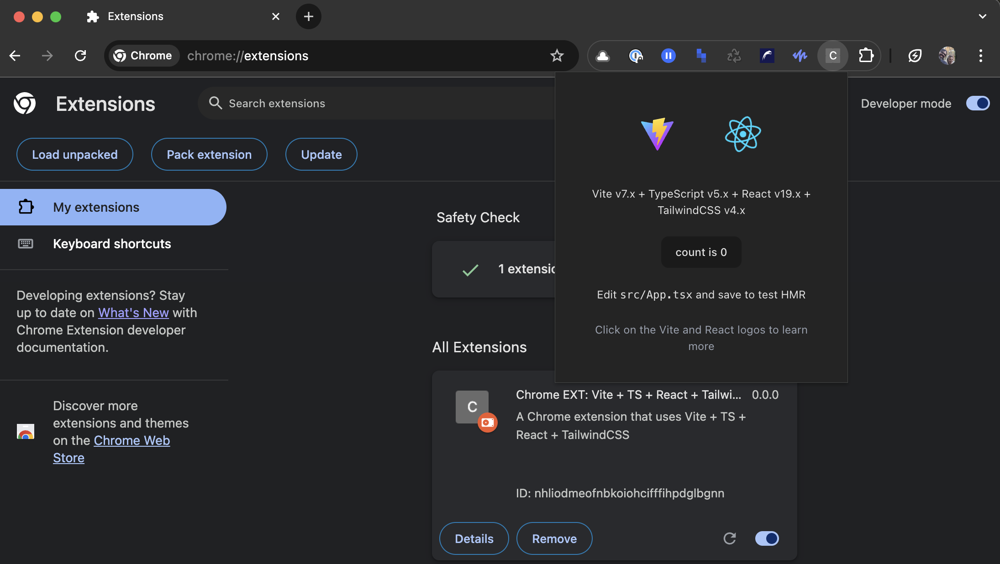

# Google Chrome Extension React Hello 🚧

A simple google chrome extension with React, TypeScript, TailwindCSS, and Vite.js.

## Project Setup

### Vite.js, React, TypeScript, and ESLint

```sh
npm create vite@latest . -- --template react-ts
```

### Prettier

```sh
npm i -D prettier eslint-config-prettier eslint-plugin-prettier
```

### Git Hooks

```sh
npm i -D simple-git-hooks is-ci lint-staged
```

### TailwindCSS

```sh
npm i -S tailwindcss

npm i -D @tailwindcss/vite prettier-plugin-tailwindcss
```

### Custom Import Paths

```sh
npm i -D vite-tsconfig-paths
```

### Google Chrome Extension

- [[YouTube] How to Build Chrome Extensions | The Dev Logger](https://www.youtube.com/watch?v=dPJjcVJAa5k) (2024-05-11)

1. Create the `manifest.json` file inside of the `public` directory
2. run `npm run build`
3. Open the Google Chrome browser and navigate to `chrome://extensions`
4. Active the `Developer mode`
5. Click the `Load unpacked` button
6. Select the `dist` directory



### Hot Reload

- [[GitHub] crxjs/chrome-extension-tools](https://github.com/crxjs/chrome-extension-tools)
  - [Install Vite and CRXJS | From Scratch - CRXJS](https://crxjs.dev/guide/installation/from-scratch#install-vite-and-crxjs)

```sh
npm i -D vite @crxjs/vite-plugin
```

## CLI Commands

ESLint: `npm run lint`

Prettier: `npm run prettify`

Development: `npm start`

## Useful References

- [Google Chrome Extension Documentation](https://developer.chrome.com/docs/extensions/mv3/)

- [How to develop a google chrome extension | Perplexity.ai](https://www.perplexity.ai/search/how-to-develop-a-google-chrome-m2dt9QwlRCOWTIeCo4dGBQ)

- [How to build a google chrome extension using react, tailwind and vite.js? | Perplexity.ai](https://www.perplexity.ai/search/how-to-build-a-google-chrome-e-YMHd1MQUQtyNebQpw2sysg)

- [[GitHub] JohnBra/vite-web-extension](https://github.com/JohnBra/vite-web-extension) - Web extension template to build Chrome and Firefox extensions quickly. Setup with React 19, Typescript and TailwindCSS
